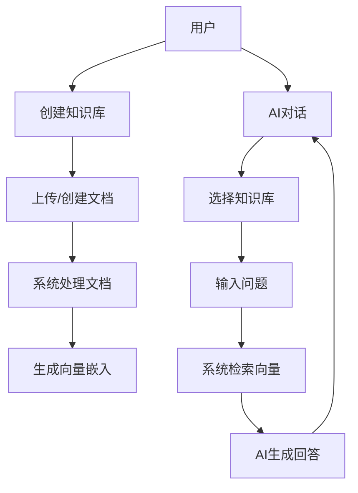

## 1. Product Overview
MySkills是一个全栈的私有文档Skill系统，允许用户上传和管理私有文档并通过AI对话基于这些文档回答问题。
- 解决用户管理私有知识库并利用AI获取智能回答的问题，目标用户为需要知识管理和AI辅助的个人和团队。
- 产品价值在于将个人知识资产转化为可交互的智能系统，提高信息获取效率和决策质量。

## 2. Core Features

### 2.1 User Roles
| Role | Registration Method | Core Permissions |
|------|---------------------|------------------|
| Default User | 无需注册，本地使用 | 所有功能权限 |

### 2.2 Feature Module
1. **仪表盘**: 系统概览，快速访问核心功能
2. **知识库管理**: 创建、编辑、删除知识库，查看统计信息
3. **文档管理**: 上传、创建、查看、删除文档
4. **Excel文档管理**: 专门处理Excel文件，支持不同分块模式
5. **向量管理**: 测试向量检索，重建向量索引
6. **AI对话**: 基于私有文档的智能对话，支持流式响应
7. **Skill配置**: 配置Function Calling和检索参数
8. **调试面板**: 测试Skill调用效果，查看检索结果
9. **智能体模板**: 管理智能体提示词模板

### 2.3 Page Details
| Page Name | Module Name | Feature description |
|-----------|-------------|---------------------|
| 仪表盘 | 系统概览 | 显示知识库数量、文档数量、向量数量等统计信息，提供快速导航 |
| 知识库管理 | 知识库列表 | 展示所有知识库，支持创建、编辑、删除操作 |
| 知识库管理 | 知识库详情 | 显示知识库文档列表，生成摘要，查看统计信息 |
| 文档管理 | 文档上传 | 支持上传MD、TXT、PDF、DOCX格式文档 |
| 文档管理 | 文档创建 | 直接创建Markdown文档 |
| 文档管理 | 文档详情 | 查看文档内容和向量信息 |
| Excel文档管理 | Excel上传 | 上传Excel文件，配置分块模式 |
| Excel文档管理 | 分块预览 | 预览分块效果，调整分块参数 |
| 向量管理 | 检索测试 | 输入查询测试向量检索效果 |
| 向量管理 | 索引重建 | 重新生成知识库的向量索引 |
| AI对话 | 聊天界面 | 与AI进行对话，选择知识库，查看流式响应 |
| AI对话 | 配置设置 | 配置LLM API和聊天参数 |
| Skill配置 | Function配置 | 定义Skill的描述和参数 |
| Skill配置 | 检索参数 | 配置top_k和相似度阈值 |
| 调试面板 | Skill测试 | 在线测试Skill调用效果 |
| 调试面板 | 检索结果 | 查看检索结果和相似度分数 |
| 智能体模板 | 模板列表 | 查看和管理智能体提示词模板 |
| 智能体模板 | 模板详情 | 查看模板内容，编辑模板 |

## 3. Core Process
### 用户主要流程
1. 用户创建知识库
2. 用户上传或创建文档
3. 系统自动处理文档，生成向量嵌入
4. 用户通过AI对话界面提问
5. 系统检索相关文档向量
6. AI基于检索结果生成回答

## 4. User Interface Design
### 4.1 Design Style
- 主色调: #3b82f6 (蓝色), #10b981 (绿色)
- 辅助色: #f97316 (橙色), #8b5cf6 (紫色)
- 按钮样式: 圆角按钮，hover效果
- 字体: Inter (无衬线字体)
- 布局风格: 侧边导航栏 + 主内容区，卡片式布局
- 图标风格: Lucide React图标库，简约现代

### 4.2 Page Design Overview
| Page Name | Module Name | UI Elements |
|-----------|-------------|-------------|
| 仪表盘 | 系统概览 | 卡片式统计数据，网格布局，柔和阴影，渐变背景 |
| 知识库管理 | 知识库列表 | 表格布局，操作按钮，状态指示器，搜索筛选 |
| 文档管理 | 文档上传 | 拖放区域，文件选择器，进度条，格式支持图标 |
| AI对话 | 聊天界面 | 消息气泡，流式打字效果，知识库选择器，发送按钮 |
| 向量管理 | 检索测试 | 输入框，结果列表，相似度分数，高亮显示 |

### 4.3 Responsiveness
- 桌面优先设计
- 平板设备: 侧边栏可折叠，内容区自适应
- 移动设备: 底部导航栏，单列布局
- 触摸优化: 按钮尺寸适合触摸，滑动操作支持

### 4.4 3D Scene Guidance
- 不适用，本项目为2D界面应用