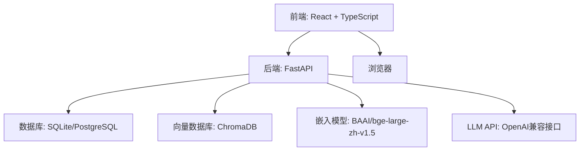
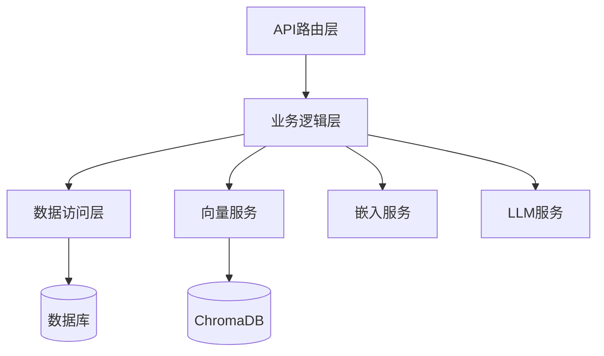
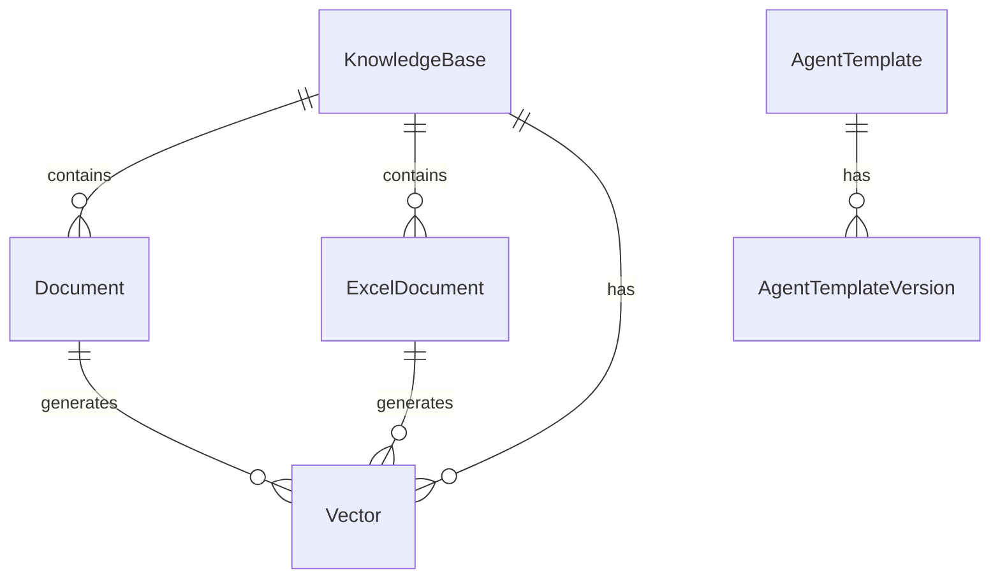

## 1. Architecture Design


## 2. Technology Description
- 前端: React@18 + TypeScript + Tailwind CSS + Vite
- 后端: FastAPI + SQLAlchemy + Alembic + ChromaDB
- 数据库: SQLite (默认) / PostgreSQL (可选)
- 向量数据库: ChromaDB
- 嵌入模型: BAAI/bge-large-zh-v1.5 (通过HuggingFaceEmbedding)
- 文件解析: python-docx, pdfplumber, openpyxl
- 容器化: Docker + Docker Compose

## 3. Route Definitions
| 路由 | 用途 |
|------|------|
| / | 仪表盘 |
| /knowledge-bases | 知识库管理 |
| /documents | 文档管理 |
| /excel-documents | Excel文档管理 |
| /vector | 向量管理 |
| /chat | AI对话 |
| /skill | Skill配置 |
| /debug | 调试面板 |
| /agent-templates | 智能体模板管理 |

## 4. API Definitions
### 4.1 知识库相关API
- `GET /api/knowledge-bases` - 获取知识库列表
- `POST /api/knowledge-bases` - 创建知识库
- `GET /api/knowledge-bases/{kb_id}` - 获取知识库详情
- `PUT /api/knowledge-bases/{kb_id}` - 更新知识库
- `DELETE /api/knowledge-bases/{kb_id}` - 删除知识库
- `POST /api/knowledge-bases/{kb_id}/generate-summary` - 生成知识库摘要

### 4.2 文档相关API
- `GET /api/knowledge-bases/{kb_id}/documents` - 获取文档列表
- `POST /api/knowledge-bases/{kb_id}/documents` - 创建文档（文本）
- `POST /api/knowledge-bases/{kb_id}/documents/upload` - 上传文档文件
- `GET /api/documents/{doc_id}` - 获取文档详情
- `DELETE /api/documents/{doc_id}` - 删除文档

### 4.3 Excel文档相关API
- `GET /api/knowledge-bases/{kb_id}/excel-documents` - 获取Excel文档列表
- `POST /api/knowledge-bases/{kb_id}/excel-documents/upload` - 上传Excel文档
- `POST /api/excel-documents/{doc_id}/chunk-and-store` - 分块并存储Excel文档
- `POST /api/excel-documents/chunk-preview` - 预览分块效果

### 4.4 向量相关API
- `GET /api/knowledge-bases/{kb_id}/vectors` - 获取向量列表
- `POST /api/knowledge-bases/{kb_id}/vectors/rebuild` - 重建向量索引
- `POST /api/vectors/retrieve` - 向量检索

### 4.5 聊天相关API
- `POST /api/chat` - 发送聊天消息（非流式）
- `POST /api/chat/stream` - 流式聊天

### 4.6 Skill相关API
- `GET /api/skill/config` - 获取Skill配置
- `PUT /api/skill/config` - 更新Skill配置
- `POST /api/skill/test` - 测试Skill调用

### 4.7 智能体相关API
- `GET /api/agent-templates` - 获取智能体模板列表
- `GET /api/agent-templates/{agent_id}` - 获取智能体模板详情

### 4.8 系统相关API
- `GET /api/system/health` - 系统健康检查

## 5. Server Architecture Diagram


## 6. Data Model
### 6.1 Data Model Definition


### 6.2 Data Definition Language
#### KnowledgeBase表
```sql
CREATE TABLE knowledge_bases (
    id UUID PRIMARY KEY,
    name VARCHAR(255) NOT NULL,
    description TEXT,
    document_count INTEGER DEFAULT 0,
    vector_count INTEGER DEFAULT 0,
    summary TEXT,
    summary_updated_at TIMESTAMP,
    created_at TIMESTAMP DEFAULT CURRENT_TIMESTAMP,
    updated_at TIMESTAMP DEFAULT CURRENT_TIMESTAMP
);
```

#### Document表
```sql
CREATE TABLE documents (
    id UUID PRIMARY KEY,
    knowledge_base_id UUID REFERENCES knowledge_bases(id),
    name VARCHAR(255) NOT NULL,
    document_type VARCHAR(50) NOT NULL,
    file_path TEXT,
    size INTEGER,
    content TEXT,
    chunk_count INTEGER DEFAULT 0,
    vector_count INTEGER DEFAULT 0,
    created_at TIMESTAMP DEFAULT CURRENT_TIMESTAMP,
    updated_at TIMESTAMP DEFAULT CURRENT_TIMESTAMP
);
```

#### ExcelDocument表
```sql
CREATE TABLE excel_documents (
    id UUID PRIMARY KEY,
    knowledge_base_id UUID REFERENCES knowledge_bases(id),
    name VARCHAR(255) NOT NULL,
    file_path TEXT,
    size INTEGER,
    sheet_count INTEGER DEFAULT 0,
    chunk_mode VARCHAR(50) DEFAULT 'row_level',
    chunk_count INTEGER DEFAULT 0,
    vector_count INTEGER DEFAULT 0,
    created_at TIMESTAMP DEFAULT CURRENT_TIMESTAMP,
    updated_at TIMESTAMP DEFAULT CURRENT_TIMESTAMP
);
```

#### Vector表
```sql
CREATE TABLE vectors (
    id UUID PRIMARY KEY,
    knowledge_base_id UUID REFERENCES knowledge_bases(id),
    document_id UUID REFERENCES documents(id),
    chunk_id VARCHAR(255),
    content TEXT NOT NULL,
    embedding JSONB NOT NULL,
    embedding_dimension INTEGER,
    metadata JSONB,
    created_at TIMESTAMP DEFAULT CURRENT_TIMESTAMP
);
```

#### AgentTemplate表
```sql
CREATE TABLE agent_templates (
    id UUID PRIMARY KEY,
    name VARCHAR(255) NOT NULL,
    type VARCHAR(50) NOT NULL,
    description TEXT,
    status VARCHAR(50) DEFAULT 'active',
    templates JSONB NOT NULL,
    created_at TIMESTAMP DEFAULT CURRENT_TIMESTAMP,
    updated_at TIMESTAMP DEFAULT CURRENT_TIMESTAMP
);
```